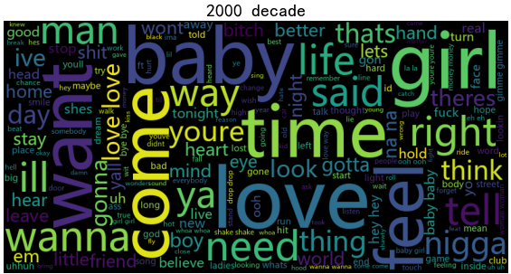
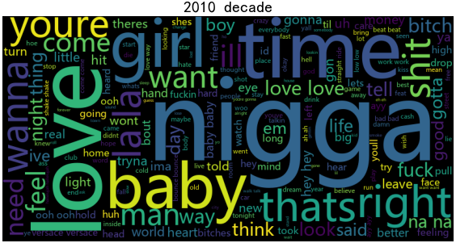

# Final project_MACS30123_Lyrics Analysis.
This is the GitHub repository for the final project of MACS 30123 Large Scale Computing.

Author: Baotong Zhang, Guangyuan Chen, Xin Li, Zhiyun Hu

## Social Science Research Questions    


## Large-Scale Computing Strategies    


## Structure of Project   

1. Data collection
   * Serial scraping
   * Parallel scraping

2. Data cleaning: Dask

3. Data Statistics and plot: Dask

4. NLP and Machine Learning with Spark: 
     * Topic Model 
       * Process the lyrics text into features
       * Train LDA Topic Model to extract topics from lyrics text 
       * WordCloud Visualization
     * Prediction
       * Merge the cleaned data with weeks-on-board target
       * Upload merged data to S3
       * Train a logistic regression and report the classification outcomes

6. Summary and Analysis

## Key Steps based on large-scale computing
### 1. Data Collection by Parallel 
#### made by: Baotong Zhang

> Serial: https://github.com/lsc4ss-s22/final-project-lyrics/blob/main/Code/Part_01_Data_Collection/lyrics_scrapping(serial).ipynb
> 
> Parallel: https://github.com/lsc4ss-s22/final-project-lyrics/blob/main/Code/Part_01_Data_Collection/lyrics_scrapping(parallel).ipynb

* We used a data set from Kaggle(https://www.kaggle.com/datasets/dhruvildave/billboard-the-hot-100-songs) to provide us with the song information on Billboard from 1958 and 2021. And then, we scrapped the data using Genius API and LyricsGenius package. We tried to use mpi4py to parallel this scrapping process: We distributed the whole task to 16 processes and each process was going to scrap the data for four years. For example, process 0 scrapped data from 1958 to 1961. Therefore we scrapped the data from 1958 to 2021.
* However, the issue is that we always got banned after the parallel scrapper had been going for a while even though we set a sleep time. The reason might be the website limits the number of times that we request at the same time(in our case, there are sixteen requests at the same time).
* Therefore, we used the data from the serial scrapper. However, the parallel scrapper worked fine on Baotong's compuer(16 cores CPU).

#### Main codes:
```python
import pandas as pd
import csv
import re
from lyricsgenius import Genius
from mpi4py import MPI

songs = pd.read_csv('billboard.csv')
songs['year'] = pd.DatetimeIndex(songs['date']).year
songs.drop(['date', 'rank', 'last-week', 'peak-rank', 'weeks-on-board'], axis=1, inplace=True)
songs.drop_duplicates(inplace=True)
sampled_df = songs.groupby('year').sample(n=150, random_state=42, replace=False)

token = 'JyD9-_LdqpyHilUA3esIXZt0Dp4Ftcc4TMo9cq7b4q2zLVfDDR1AYtIoXsXnf1DS'
genius = Genius(token)
genius.verbose = False # Turn off status messages
genius.remove_section_headers = True # Remove section headers (e.g. [Chorus]) from lyrics when searching
genius.skip_non_songs = False # Include hits thought to be non-songs (e.g. track lists)
genius.excluded_terms = ["(Remix)", "(Live)"] # Exclude songs with these words in their title

def scraper(years, file_name):
    with open(file_name+'.csv', 'w', newline="", encoding='utf-8') as csvfile:
        output = csv.writer(csvfile)
        output.writerow(['Year', 'Artist', 'Song Name', 'Lyrics'])
        for year in range(years[0], years[1]):
            year_df = sampled_df[sampled_df['year'] == year]
            for i in range(150):
                song_name = year_df.iloc[i, 0]
                song_artist = re.split('& | Featuring | And', year_df.iloc[i, 1]) + [year_df.iloc[i, 1]]
                try:
                    for j in song_artist:
                        if genius.search_artist(j , max_songs=1, sort="title"):
                            artist = genius.search_artist(j , max_songs=1, sort="title")
                            try:
                                song = artist.song(song_name)
                                lyrics = song.lyrics
                                output.writerow([year, year_df.iloc[i, 1], song_name, lyrics])
                                break
                            except:
                                continue
                        else:
                            continue
                except:
                    pass

comm = MPI.COMM_WORLD
size = comm.Get_size()
rank = comm.Get_rank()
name = MPI.Get_processor_name()

base = 1958 + 4 * rank
years = (base, base + 4)
scraper(years, file_name=f'part{rank}')
print(f'part{rank} done!')
```

### 2. Data Cleaning by Dask 
#### made by: Zhiyun Hu

> https://github.com/lsc4ss-s22/final-project-lyrics/blob/main/Code/Part_02_Data_Cleaning/lyrics_data_cleaning_dask.ipynb

* The raw dataset we scrapped is messy and full of meaningless noise in the website. So we decided to use Dask for further clean using Dask, which could improve the efficiency than local computer. 
* For standardize the input language and facilitate nlp learning, We first remove non-english songs. remove songs with unmatched name and lyrics, and also remove stop words (that we collected both from packages and our own identification) to accurately grasp the topic information from the lyrics. 
* Finally, we compiled the cleaned lyrics for each year, and every 10 years. We sent the data into our group's S3 database for further analysis.

#### Main codes:
```python
# Remove Non-English Songs
lyrics_raw[['Lyrics']] = lyrics_raw[['Lyrics']].astype(str)
lyrics_raw = lyrics_raw[lyrics_raw.Lyrics.map(lambda x: x.isascii())]

# remove the columns where there is no related songs and lyrics
lyrics_raw['check'] = lyrics_raw.apply(lambda x: x.song_name in x.Lyrics and "Lyrics" in x.Lyrics, 
                                       axis=1, 
                                       meta = pd.Series(name = "check", dtype = np.bool))
# Drop all the values if the check value equals to false
lyrics_raw = lyrics_raw.loc[lyrics_raw['check']==True]

# Remove the stop words
lyrics_raw['lower_text'] = lyrics_raw['Lyrics'].apply(lambda x: " ".join(x.lower() for x in x.split()),
                                                     meta = ('lower_text', 'object'))
lyrics_raw['text_nonpuc'] = lyrics_raw['lower_text'].str.replace('[^\w\s]', '', regex = True)
lyrics_raw['clean_text'] = lyrics_raw['text_nonpuc'].apply(lambda x: " ".join(x for x in x.split() if x not in stop_words), 
                                                           meta = ('clean_text', 'object'))
```

### 3. Data Overview by Dask 
#### made by: Guangyuan Chen
> https://github.com/lsc4ss-s22/final-project-lyrics/blob/main/Code/Part_03_Data_Overview/cleaned_data_overview_dask.ipynb
> 
* From the previous step, we have obtained more than five thousand songs data. To better understand the dataset to analyse, we need to make an overview on the data and have a basic knowledge about it.
* In this step, we complete the overview with the help of one singer dataset posted on Kaggle, which include detailed information of each singer such as music genre and their country. With this dataset, we can see an development trend over decades.
* In the end, we got the most famous superstar, singer distribution trend, music genre popularity development and the overall competition level changes over decades.

#### Main Results:

1. Superstars in each decade


2. Competition level over decades


3. Singer country distribution


4. Genre popularity trend over decades


### 4. Topic Model and Visualization by Pyspark 
#### made by: Xin Li, Guangyuan Chen
> Upload data to S3: https://github.com/lsc4ss-s22/final-project-lyrics/blob/main/Code/Part_04_Topic_Model_Visualization/upload_lyrics_to_s3.ipynb
> 
> Topic model and Visualization: https://github.com/lsc4ss-s22/final-project-lyrics/blob/main/Code/Part_04_Topic_Model_Visualization/topic_model_lyrics_visualization.ipynb

* From the previous step, we have obtained more than five thousand songs data. To better understand the dataset to analyse, we need to make an overview on the data and have a basic knowledge about it.
* In this step, we complete the overview with the help of one singer dataset posted on Kaggle, which include detailed information of each singer such as music genre and their country. With this dataset, we can see an development trend over decades.
* In the end, we got the most famous superstar, singer distribution trend, music genre popularity development and the overall competition level changes over decades.

#### Main codes:
```python
def set_document_assembler(inputCol):
    '''Document assembler'''
    return DocumentAssembler().setInputCol(inputCol)


def set_tokenizer(inputCol, outputCol):
    '''Tokenize words'''
    tokenizer = (Tokenizer()
        .setInputCols([inputCol])
        .setOutputCol(outputCol)
    )
    return tokenizer


def set_lemmatizer(inputCol, outputCol):
    '''Set root lemmas for tokens'''
    lemmatizer = (LemmatizerModel.pretrained(name="lemma_antbnc", lang="en")
        .setInputCols([inputCol])
        .setOutputCol(outputCol)
    )
    return lemmatizer

def set_finisher(finishedCol):
    '''Transform the words using finisher'''
    finisher = (Finisher()
        .setInputCols([finishedCol])
        .setIncludeMetadata(False)
    )
    return finisher

    
def nlp_lyrics(data):
    '''
    Deal with the data of lyrics using NLP pipeline consisting of the above steps
    Input: the dataset read from csv
    Output: dataframe with tokens
    '''
    
    # Remove stop words in text
    STOP_WORDS =["i'm", "don't", "like", 'lyrics','lyric','too', 'hence', 'give', 'never', 'without', "'m", 'something', "'s", 'well', 'hers', 'nine', 'off', 'noone', 'used', 'onto', 'to', 'much', 'us', 'via', 'less', 'had', 'anyone', 'neither', 'an', 'full', 'then', 'twenty', 'thereby', 'keep', 'yourself', 'thus', 'using', 'yourselves', 'each', 'which', 'how', 'doing', '’re', 'whereby', 'with', 'somewhere', 'name', 'that', 'otherwise', 'of', 'around', 'about', 'side', 'sometime', 'back', 'become', 'thru', 'ca', 'becoming', 'formerly', 'empty', 'not', 'often', 'such', 'very', 'therein', 'among', 'here', 'other', 'below', 'again', 'either', 'we', 'what', '’d', 'hereafter', 'ours', 'fifty', 'ourselves', 'your', 'front', 'by', 'upon', 'myself', 'or', 're', 'two', 'thence', 'hundred', 'anywhere', 'make', 'toward', 'towards', 'might', 'thereupon', 'should', 'forty', 'everything', 'me', 'unless', 'nevertheless', 'anyhow', 'former', 'behind', 'always', 'before', 'except', '‘ll', 'wherever', 'nowhere', 'first', 'do', 'move', 'any', 'say', 'been', 'who', 'at', 'also', 'themselves', 'somehow', 'can', 'will', '’s', 'wherein', 'least', 'namely', 'in', 'meanwhile', 'beyond', 'alone', 'moreover', 'and', 'due', 'himself', 'where', 'does', 'she', 'must', 'just', 'hereupon', 'herself', 'n‘t', 'being', 'under', "n't", 'why', 'another', 'during', 'his', 'no', "'ll", '’ve', 'everywhere', 'latterly', 'them', 'seems', 'would', 'next', 'this', 'put', 'third', 'made', 'together', 'as', 'enough', 'but', 'whole', 'you', 'rather', 'our', 'call', 'some', 'between', 'every', 'the', 'everyone', 'their', 'were', 'please', 'six', 'whose', 'perhaps', 'up', 'done', 'whom', 'thereafter', '‘ve', 'indeed', '‘s', 'twelve', '’m', 'sometimes', 'is', 'becomes', 'its', 'may', 'down', 'seemed', 'all', 'many', 'further', 'though', 'through', 'eight', 'are', 'became', 'they', 'yet', 'whither', 'against', 'cannot', 'bottom', 'whereafter', 'none', 'only', 'latter', 'since', 'else', 'was', 'more', 'various', 'serious', 'sixty', "'re", 'take', 'part', 'beside', 'most', 'ever', 'he', 'out', 'over', 'my', 'quite', 'however', "'d", 'because', 'already', 'on', 'four', 'nothing', 'n’t', 'whereas', 'has', 'once', 'top', 'seeming', 'within', 'regarding', 'almost', 'afterwards', 'both', 'per', 'several', 'seem', 'am', 'see', 'whatever', 'did', 'five', 'ten', 'yours', 'really', 'a', 'anything', '‘re', 'mine', 'still', 'elsewhere', 'whence', 'from', 'nor', 'him', 'last', 'her', 'while', 'hereby', 'eleven', 'itself', 'same', 'have', 'across', 'these', 'above', 'so', '‘m', 'therefore', 'than', "'ve", 'others', 'whenever', 'few', 'one', 'into', '‘d', 'get', 'amongst', 'if', 'anyway', 'whether', 'three', 'for', 'fifteen', 'after', 'nobody', 'amount', 'whereupon', 'whoever', 'could', 'it', 'when', 'someone', 'mostly', 'besides', 'although', 'now', 'go', 'until', 'i', 'own', 'herein', 'be', '’ll', 'show', 'throughout', 'even', 'there', 'beforehand', 'those', 'along']
    
    remover = (StopWordsRemover(
               inputCol="finished_lemma", outputCol="words_cleaned")
               .setStopWords(STOP_WORDS))
    
    # Construct nlp pipeline 
    nlp_pipeline = Pipeline(stages=[
        set_document_assembler("further_clean_text"),
        set_tokenizer("document", "token"),
        set_lemmatizer("token", "lemma"),
        set_finisher("lemma"),
        remover
    ])
    
    # Remove special characters
    regex = r"[\!\(\)\-\[\]\{\}\;\:\'\"\\\,\<\>\.\/\?\@\#\$\%\^\&\*\_\~\']"
    df = data.withColumn('further_clean_text',f.regexp_replace('further_clean_text', regex, '')) \
                         .withColumn('further_clean_text',f.regexp_replace('further_clean_text', r"\n", ' ')) \
                         .withColumn('further_clean_text',f.regexp_replace('further_clean_text', r" i ", '')) \
                         .withColumn('further_clean_text',f.regexp_replace('further_clean_text', r" it ", ''))
    
    # Take action to fit the pipeline to data
    token_df = (nlp_pipeline.fit(df)
        .transform(df)
        .withColumnRenamed('words_cleaned', 'lyrics_words')
    )
    
    return token_df

def get_topics(df):
    
    """
    Get topic words and weights from the LDA model.
    
    Input: the processed dataframe
    Output: topics, shown as a lists.
    """
    
    # Set parameters grid for further usage
    params = dict(
        num_topics = 10,iterations = 10,vocabsize = 5000,
        minDF = 0.02, maxDF = 0.8, minTF = 1)
    
    # Covert tokens into features
    countvectorizer = CountVectorizer(
            inputCol="lyrics_words",
            outputCol="features",
            vocabSize=params['vocabsize'],
            minDF=params['minDF'],
            maxDF=params['maxDF'],
            minTF=params['minTF'])
    
    idf = IDF(inputCol="features", outputCol="idf")

    # Contruct pipeline consisting of countvectorizer and idf
    Pipeline1 = Pipeline(stages=[
                countvectorizer,
                idf])
    # Construct model for Lda topic model
    lda = LDA(
            k=params['num_topics'],
            maxIter=params['iterations'],
            optimizer="online",
            seed=0,
            learningOffset=100.0, 
            learningDecay=0.51,)
    Pipeline2 = Pipeline(stages=[lda])
    
    ml1 = Pipeline1.fit(df)
    ml1_df = ml1.transform(df)
    ml2 = Pipeline2.fit(ml1_df)

    # Obtain topic model
    vocabulary = ml1.stages[0].vocabulary
    ldaModel = ml2.stages[-1]

    # Extract top 15 words for each topic
    topics = ldaModel.describeTopics(15)
    
    # Convert the DataFrame back into an RDD to use the LDA algorithm,
    rdd = topics.rdd

    rdd_topics = rdd \
        .map(lambda row: row['termIndices']) \
        .map(lambda idx_list: [vocabulary[i] for i in idx_list]) \
        .collect()

    rdd_weights = rdd \
        .map(lambda row: row['termWeights']) \
        .collect()

    # Put results in a list
    topics = [dict(zip(output_words, output_weights))
              for output_words, output_weights in zip(rdd_topics, rdd_weights)]
    return topics
```

#### Main Results:






### 5. Prediction Result by Pyspark NLP 
#### made by: Baotong Zhang
> Merge and Upload: https://github.com/lsc4ss-s22/final-project-lyrics/blob/main/Code/Part_04_Prediction/Data_Merge_Upload.ipynb

> Model Training: https://github.com/lsc4ss-s22/final-project-lyrics/blob/main/Code/Part_04_Prediction/Task1_prediction.ipynb

> Note: We used Pyspark on AWS because after vectorizing the lyrics, the number of features exploded.
* We did our prediction job on AWS by using Pyspark
* Target: whether a song is long-lasting on the board(>=16 weeks)
* Features:
  * Length oFf lyrics; Length of name 
   Sentiment of lyrics by Spark NLP 
  * Vectorized lyrics; Vectorized name 
* Result: AUC = 0.65

* As we could see, the results are acceptable with sparse representation of our features.


## Summarization


## Reference    
