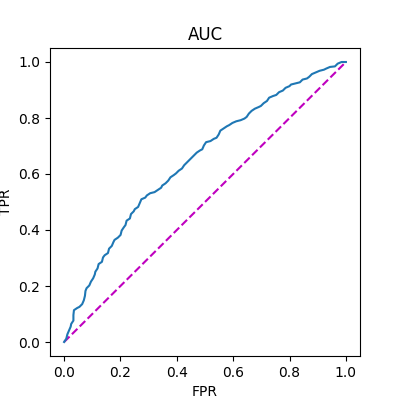

# Final project_MACS30123_Lyrics Analysis.
This is the GitHub repository for the final project of MACS 30123 Large Scale Computing.

Author: Baotong Zhang, Guangyuan Chen, Xin Li, Zhiyun Hu

## Social Science Research Questions    

## Large-Scale Computing Strategies    

## Structure of Project   

1. Data collection
   * Serial scraping
   * Parallel scraping

2. Data cleaning: Dask

3. Data Statistics and plot: Dask

4. NLP and Machine Learning with Spark: 
     * Topic Model 
       * Process the lyrics text into features
       * Train LDA Topic Model to extract topics from lyrics text 
     * Prediction
       * Merge the cleaned data with weeks-on-board target
       * Upload merged data to S3
       * Train a logistic regression and report the classification outcomes

6. Summary and Analysis

## Data 
### Data Collection: Baotong Zhang
#### Code: 
> 
> Serial: https://github.com/lsc4ss-s22/final-project-lyrics/blob/main/Code/Part_01_Data_Collection/lyrics_scrapping(serial).ipynb
> 
> Parallel: https://github.com/lsc4ss-s22/final-project-lyrics/blob/main/Code/Part_01_Data_Collection/lyrics_scrapping(parallel).ipynb
* We used a data set from Kaggle to provide us with the song information on Billboard from 1958 and 2021. And then, we scrapped the data using Genius API and LyricsGenius package. We tried to use mpi4py to parallel this scrapping process: We distributed the whole task to 16 processes and each process was going to scrap the data for four years. For example, process 0 scrapped data from 1958 to 1961. Therefore we scrapped the data from 1958 to 2021.
* However, the issue is that we always got banned after the parallel scrapper had been going for a while even though we set a sleep time. The reason might be the website limits the number of times that we request at the same time(in our case, there are sixteen requests at the same time).
* Therefore, we used the data from the serial scrapper. However, the parallel scrapper worked fine on Baotong's compuer(16 cores CPU).

## Results   
### Prediction: Baotong Zhang
#### Code: 
> Merge and Upload: https://github.com/lsc4ss-s22/final-project-lyrics/blob/main/Code/Part_04_Prediction/Data_Merge_Upload.ipynb

> Model Training: https://github.com/lsc4ss-s22/final-project-lyrics/blob/main/Code/Part_04_Prediction/Task1_prediction.ipynb

> Note: We used Pyspark on AWS because after vectorizing the lyrics, the number of features exploded. 
* We did our prediction job on AWS by using Pyspark
* Target: whether a song is long-lasting on the board(>=16 weeks)
* Features:
  * Length oFf lyrics; Length of name 
   Sentiment of lyrics by Spark NLP 
  * ectorized lyrics; Vectorized name 
* Result: AUC = 0.65

* As we could see, the results are acceptable with sparse representation of our features.

## Summarization

## Reference    
